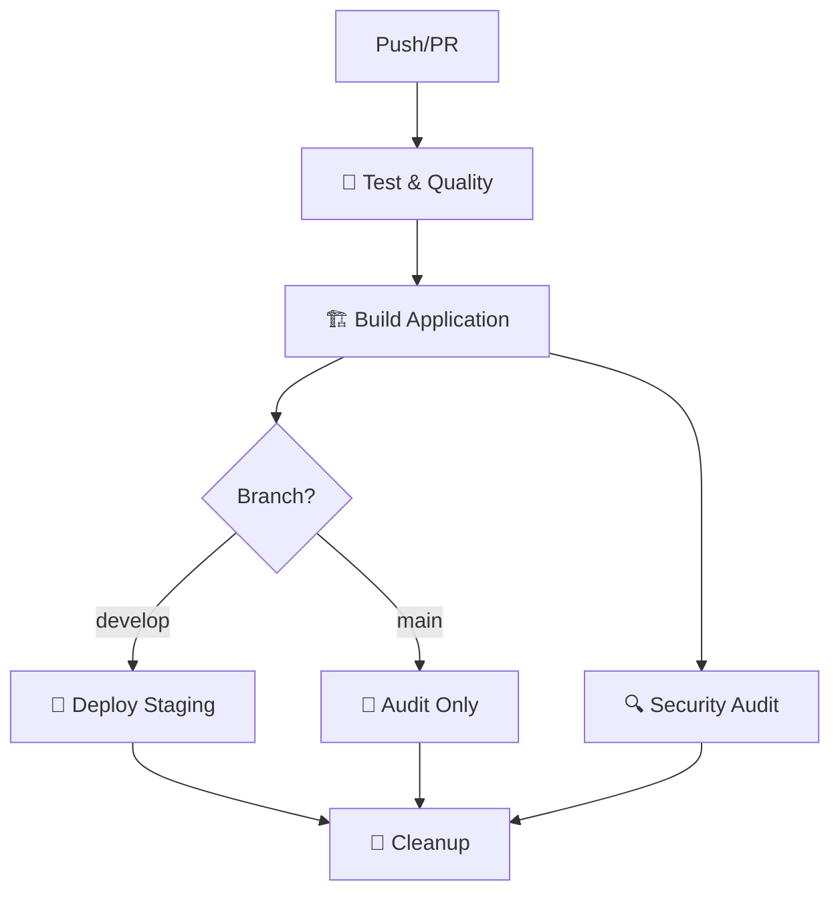

# 🚀 CI/CD Pipeline Setup Guide

This guide will help you set up the complete CI/CD pipeline for WellnessPal using GitHub Actions and Netlify.

## 📋 Prerequisites

- GitHub repository with admin access
- Netlify account
- Supabase project (for environment variables)

## 🔧 Setup Steps

### 1. **GitHub Repository Secrets**

Go to your GitHub repository → Settings → Secrets and variables → Actions, and add these secrets:

#### **Required Secrets:**
```bash
# Netlify Configuration
NETLIFY_AUTH_TOKEN=your_netlify_personal_access_token
NETLIFY_STAGING_SITE_ID=your_staging_site_id  # For develop branch

# Supabase Configuration
NEXT_PUBLIC_SUPABASE_URL=your_supabase_project_url
NEXT_PUBLIC_SUPABASE_ANON_KEY=your_supabase_anon_key

# Optional: Code Coverage
CODECOV_TOKEN=your_codecov_token  # If using Codecov
```

#### **How to Get Netlify Tokens:**

1. **Netlify Auth Token:**
   - Go to [Netlify User Settings](https://app.netlify.com/user/applications)
   - Click "New access token"
   - Name it "GitHub Actions"
   - Copy the token

2. **Netlify Site ID:**
   - Go to your Netlify site dashboard
   - Site settings → General → Site details
   - Copy the "Site ID"

### 2. **Branch Protection Rules**

Set up branch protection for `main` and `develop` branches:

1. Go to Settings → Branches
2. Add rule for `main`:
   - ✅ Require a pull request before merging
   - ✅ Require status checks to pass before merging
   - ✅ Require branches to be up to date before merging
   - ✅ Include administrators

3. Add rule for `develop`:
   - ✅ Require status checks to pass before merging
   - ✅ Require branches to be up to date before merging

### 3. **Environment Setup**

Create GitHub Environments for deployment protection:

1. Go to Settings → Environments
2. Create `production` environment:
   - ✅ Required reviewers (add team members)
   - ✅ Wait timer: 5 minutes
   - ✅ Deployment branches: `main` only

3. Create `staging` environment:
   - ✅ Deployment branches: `develop` only

## 🔄 Workflow Overview

### **Main CI/CD Pipeline** (`.github/workflows/ci-cd.yml`)



#### **Jobs:**
1. **🧪 Test & Quality**
   - Lint code (ESLint)
   - Type checking (TypeScript)
   - Run tests (if available)
   - Upload coverage reports

2. **🏗️ Build Application**
   - Install dependencies
   - Build Next.js application
   - Verify build success

3. **🚀 Deploy Staging** (develop branch only)
   - Deploy to Netlify staging
   - Comment deployment URL on PRs

4. **🔍 Security & Performance Audit**
   - Security vulnerability scan
   - Bundle size analysis

**Note:** Production deployment is done manually via Netlify dashboard for better control.

### **PR Preview Pipeline** (`.github/workflows/pr-preview.yml`)

- Deploys every PR to a unique preview URL
- Comments preview link on PR
- Updates automatically on new commits

### **Dependency Updates** (`.github/workflows/dependency-update.yml`)

- Runs weekly (Mondays at 9 AM UTC)
- Checks for security vulnerabilities
- Updates minor/patch versions
- Creates automated PR with updates

### **Performance Monitoring** (`.github/workflows/performance-monitoring.yml`)

- Runs daily performance audits
- Monitors Core Web Vitals
- Tracks bundle size changes
- Generates performance reports

## 🎯 Deployment Strategy

### **Branching Strategy:**
```
main (production)     ←── merge ←── develop (staging)     ←── merge ←── feature/branch
  ↓                                    ↓                              ↓
🌟 Production Deploy              🚀 Staging Deploy              🔍 PR Preview
```

### **Environment URLs:**
- **Staging:** `https://wellnesspal-staging.netlify.app`
- **Production:** Manual deployment via Netlify dashboard

## 📊 Quality Gates

### **Required Checks:**
- ✅ ESLint passes (no errors)
- ✅ TypeScript compilation succeeds
- ✅ Build completes successfully
- ✅ Security audit passes (high vulnerabilities)
- ✅ Performance score > 85%
- ✅ Accessibility score > 95%

### **Performance Thresholds:**
- **Performance:** > 85%
- **Accessibility:** > 95%
- **Best Practices:** > 90%
- **SEO:** > 90%
- **PWA:** > 80%

## 🔒 Security Features

### **Automated Security:**
- Daily dependency vulnerability scans
- Automatic security patch PRs
- Bundle analysis for malicious code
- Environment variable protection

### **Access Control:**
- Branch protection rules
- Required PR reviews for production
- Environment-specific secrets
- Deployment approval gates

## 📈 Monitoring & Alerts

### **Performance Monitoring:**
- Daily Lighthouse audits
- Bundle size tracking
- Core Web Vitals monitoring
- Performance regression alerts

### **Deployment Monitoring:**
- Build success/failure notifications
- Deployment status updates
- Automatic rollback on failures
- Health check monitoring

## 🚀 Getting Started

1. **Push to develop branch:**
   ```bash
   git checkout develop
   git add .
   git commit -m "feat: add new feature"
   git push origin develop
   ```
   → Triggers staging deployment

2. **Create Pull Request to main:**
   ```bash
   gh pr create --base main --head develop --title "Release v1.0.0"
   ```
   → Triggers PR preview and production deployment after merge

3. **Monitor deployments:**
   - Check GitHub Actions tab for build status
   - Review deployment URLs in PR comments
   - Monitor performance reports

## 🛠️ Troubleshooting

### **Common Issues:**

1. **Build Failures:**
   - Check environment variables are set
   - Verify Supabase credentials
   - Review build logs in Actions tab

2. **Deployment Failures:**
   - Verify Netlify tokens are valid
   - Check site ID matches your Netlify site
   - Ensure publish directory is correct (`.next`)

3. **Performance Issues:**
   - Review Lighthouse reports
   - Check bundle size analysis
   - Optimize images and assets

### **Debug Commands:**
```bash
# Local build test
npm run build

# Local lint check
npm run lint

# Type check
npx tsc --noEmit

# Security audit
npm audit --audit-level=high
```

## 📞 Support

- **GitHub Issues:** Report bugs and feature requests
- **Discussions:** Ask questions and share ideas
- **Wiki:** Detailed documentation and guides

---

**🎉 Your CI/CD pipeline is now ready!** Every push will trigger automated testing, building, and deployment to ensure WellnessPal maintains the highest quality standards.