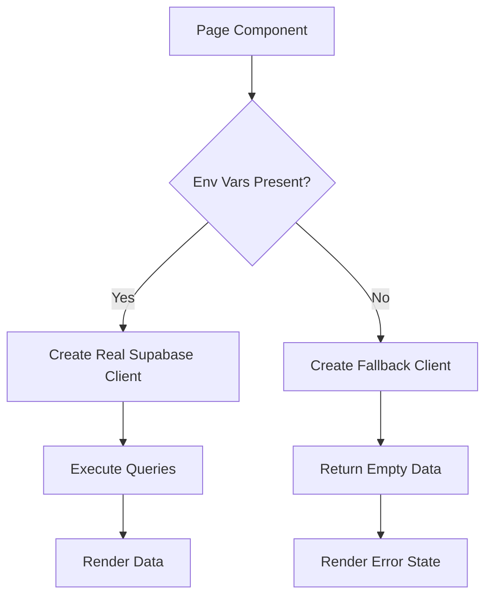

# Design Document: Environment Variable Handling

## Overview

This design addresses the critical issue of build failures caused by missing Supabase environment variables during Next.js static page generation. The solution implements a graceful degradation strategy that allows builds to succeed while providing clear runtime feedback when configuration is missing.

The core approach is to:
1. Detect missing environment variables at multiple layers (build-time, initialization, runtime)
2. Provide safe fallbacks during build to prevent failures
3. Display user-friendly error states at runtime when credentials are missing
4. Maintain type safety and developer experience

## Architecture

### Layered Error Handling Strategy

```
┌─────────────────────────────────────────┐
│         Build Time (SSG/SSR)            │
│  - Allow build to complete              │
│  - Return mock/null clients safely      │
└─────────────────┬───────────────────────┘
                  │
┌─────────────────▼───────────────────────┐
│      Client Initialization              │
│  - Check environment variables          │
│  - Create real or fallback client       │
└─────────────────┬───────────────────────┘
                  │
┌─────────────────▼───────────────────────┐
│         Runtime Usage                   │
│  - Detect missing configuration         │
│  - Show error UI with instructions      │
└─────────────────────────────────────────┘
```

### Component Interaction



## Components and Interfaces

### 1. Environment Configuration Module

**Purpose**: Centralize environment variable validation and provide type-safe access

```typescript
// src/lib/env.ts
interface EnvironmentConfig {
  supabaseUrl: string | undefined;
  supabaseAnonKey: string | undefined;
  isConfigured: boolean;
}

function getEnvironmentConfig(): EnvironmentConfig

function validateEnvironment(): { 
  isValid: boolean; 
  missing: string[]; 
  message: string;
}
```

### 2. Enhanced Supabase Client Factory

**Purpose**: Create Supabase clients with graceful fallback behavior

```typescript
// src/lib/supabase/client.ts
type SupabaseClient = ReturnType<typeof createBrowserClient> | null;

interface ClientOptions {
  throwOnMissing?: boolean;  // Default: false
  isBuildTime?: boolean;      // Auto-detected
}

function createClient(options?: ClientOptions): SupabaseClient

function isBuildTime(): boolean
```

### 3. Configuration Error Boundary

**Purpose**: Catch and display configuration errors at the UI level

```typescript
// src/components/config-error-boundary.tsx
interface ConfigErrorBoundaryProps {
  children: React.ReactNode;
  fallback?: React.ReactNode;
}

function ConfigErrorBoundary(props: ConfigErrorBoundaryProps): JSX.Element
```

### 4. Configuration Status Component

**Purpose**: Display user-friendly error messages with setup instructions

```typescript
// src/components/configuration-error.tsx
interface ConfigurationErrorProps {
  missingVars: string[];
  showInstructions?: boolean;
}

function ConfigurationError(props: ConfigurationErrorProps): JSX.Element
```

### 5. Safe Hook Wrapper

**Purpose**: Wrap data-fetching hooks to handle missing configuration

```typescript
// src/hooks/use-safe-query.ts
interface SafeQueryOptions<T> {
  queryKey: string[];
  queryFn: () => Promise<T>;
  fallbackData?: T;
  requiresAuth?: boolean;
}

function useSafeQuery<T>(options: SafeQueryOptions<T>): {
  data: T | undefined;
  error: Error | null;
  isLoading: boolean;
  isConfigured: boolean;
}
```

## Data Models

### Environment Configuration State

```typescript
interface EnvironmentState {
  isConfigured: boolean;
  missingVariables: string[];
  errorMessage: string | null;
  checkedAt: Date;
}
```

### Client Initialization Result

```typescript
type ClientResult = 
  | { success: true; client: SupabaseClient }
  | { success: false; error: string; fallback: null };
```

## Correctness Properties

*A property is a characteristic or behavior that should hold true across all valid executions of a system—essentially, a formal statement about what the system should do. Properties serve as the bridge between human-readable specifications and machine-verifiable correctness guarantees.*


### Property 1: Build Success Without Credentials

*For any* Next.js build command (build, export, or static generation), when Supabase environment variables are not set, the build process should complete successfully with exit code 0.

**Validates: Requirements 1.1, 4.1, 4.2, 4.3**

### Property 2: Runtime Safety Without Credentials

*For any* component or page that uses the Supabase client, when environment variables are missing at runtime, the component should render an error state UI rather than throwing an uncaught exception or crashing.

**Validates: Requirements 1.2, 1.3, 2.1**

### Property 3: Error Message Completeness

*For any* configuration error message displayed to users, the message should include both the list of missing variables and instructions on how to configure them.

**Validates: Requirements 2.2**

### Property 4: Normal Operation With Valid Configuration

*For any* Supabase-dependent operation, when environment variables are properly configured, the operation should execute without displaying configuration error messages.

**Validates: Requirements 2.3**

## Error Handling

### Build-Time Error Handling

**Strategy**: Detect build-time execution and return safe fallbacks

```typescript
function isBuildTime(): boolean {
  return typeof window === 'undefined' && process.env.NODE_ENV !== 'test';
}

function createClient(options?: ClientOptions): SupabaseClient {
  const config = getEnvironmentConfig();
  
  // During build, return null to prevent build failures
  if (!config.isConfigured && isBuildTime()) {
    return null;
  }
  
  // At runtime, throw or return null based on options
  if (!config.isConfigured) {
    if (options?.throwOnMissing) {
      throw new ConfigurationError(config.missing);
    }
    return null;
  }
  
  return createBrowserClient(config.supabaseUrl, config.supabaseAnonKey);
}
```

### Runtime Error Handling

**Strategy**: Catch configuration errors at component boundaries and display user-friendly UI

```typescript
function ConfigErrorBoundary({ children }: Props) {
  const config = getEnvironmentConfig();
  
  if (!config.isConfigured) {
    return <ConfigurationError missingVars={config.missing} />;
  }
  
  return <>{children}</>;
}
```

### Hook-Level Error Handling

**Strategy**: Wrap React Query hooks to handle null clients gracefully

```typescript
function useSafeQuery<T>(options: SafeQueryOptions<T>) {
  const config = getEnvironmentConfig();
  
  return useQuery({
    queryKey: options.queryKey,
    queryFn: async () => {
      if (!config.isConfigured) {
        throw new ConfigurationError(config.missing);
      }
      return options.queryFn();
    },
    enabled: config.isConfigured,
  });
}
```

### Error Message Format

All configuration errors should follow this format:

```
Missing Supabase Configuration

The following environment variables are required but not set:
- NEXT_PUBLIC_SUPABASE_URL
- NEXT_PUBLIC_SUPABASE_ANON_KEY

To fix this:
1. Copy .env.example to .env.local
2. Add your Supabase credentials from https://supabase.com/dashboard
3. Restart the development server

For more information, see the README.md file.
```

## Testing Strategy

### Dual Testing Approach

This feature requires both unit tests and property-based tests to ensure comprehensive coverage:

- **Unit tests**: Verify specific scenarios like build success, specific error messages, and documentation presence
- **Property tests**: Verify universal behaviors like runtime safety across all components and error message completeness

### Property-Based Testing

We will use **fast-check** (for TypeScript/JavaScript) as our property-based testing library. Each property test will:
- Run a minimum of 100 iterations
- Be tagged with a comment referencing the design property
- Test the universal behavior across randomized inputs

**Example Property Test Structure**:

```typescript
// Feature: environment-variable-handling, Property 2: Runtime Safety Without Credentials
test('components render error UI instead of crashing when credentials missing', () => {
  fc.assert(
    fc.property(
      fc.record({
        componentName: fc.constantFrom('MedicationsPage', 'HistoryPage', 'DashboardPage'),
        props: fc.object(),
      }),
      ({ componentName, props }) => {
        // Test that component renders without throwing
        const result = renderWithoutEnv(componentName, props);
        expect(result.hasError).toBe(false);
        expect(result.showsErrorUI).toBe(true);
      }
    ),
    { numRuns: 100 }
  );
});
```

### Unit Testing Focus Areas

1. **Build-time behavior**: Test that `npm run build` succeeds without env vars
2. **Client factory**: Test createClient() returns null when credentials missing
3. **Error messages**: Test that error components display correct instructions
4. **Documentation**: Test that .env.example and README contain required information
5. **Environment validation**: Test that validation function correctly identifies missing vars

### Integration Testing

1. **End-to-end build**: Run full build process without credentials
2. **Page rendering**: Test that pages render error states correctly
3. **Development workflow**: Test that dev server starts and shows helpful errors

### Test Configuration

All tests will be configured with:
- Test framework: Jest + React Testing Library
- Property testing: fast-check
- Minimum 100 iterations per property test
- Each test tagged with feature name and property number

### Testing Environment Setup

Tests will use environment variable mocking:

```typescript
beforeEach(() => {
  delete process.env.NEXT_PUBLIC_SUPABASE_URL;
  delete process.env.NEXT_PUBLIC_SUPABASE_ANON_KEY;
});

afterEach(() => {
  // Restore original env vars
});
```

## Implementation Notes

### Migration Strategy

1. **Phase 1**: Update client factory to handle missing credentials
2. **Phase 2**: Add environment validation module
3. **Phase 3**: Create error boundary and error UI components
4. **Phase 4**: Update all hooks to use safe client creation
5. **Phase 5**: Add documentation and examples

### Backward Compatibility

This change is backward compatible:
- Existing code with proper env vars continues to work
- New code gracefully handles missing env vars
- No breaking changes to existing APIs

### Performance Considerations

- Environment validation runs once at startup
- Client creation is memoized to avoid repeated checks
- Error boundaries add minimal overhead
- Build time is not significantly impacted

### Security Considerations

- Never log actual credential values
- Error messages should not expose sensitive information
- Fallback clients should not allow unauthorized access
- Environment variables remain in .env.local (gitignored)
