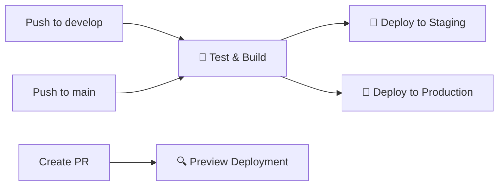

# 🏥 WellnessPal - Your Complete Health Companion

<div align="center">


**A comprehensive Progressive Web App for complete health management**

[](https://app.netlify.com/sites/wellnesspal/deploys)
[](https://github.com/laoluafolami/wellnespal/actions)
[](https://opensource.org/licenses/MIT)
[](https://www.typescriptlang.org/)
[](https://nextjs.org/)

[🌐 **Live Demo**](https://wellnesspal.netlify.app) • [📖 **Documentation**](./CICD_SETUP.md) • [🚀 **Deployment Guide**](./DEPLOYMENT.md)

</div>

---

## 🌟 **What is WellnessPal?**

WellnessPal is a **comprehensive health tracking Progressive Web App** that empowers users to monitor their vital health metrics, manage medications, and receive intelligent reminders. Built with modern web technologies, it provides a **native app-like experience** across all devices while maintaining **medical-grade accuracy** and **privacy compliance**.

### 🎯 **Perfect For:**
- 🩺 **Patients** managing chronic conditions (hypertension, diabetes)
- 👨‍⚕️ **Healthcare providers** monitoring patient progress
- 👴 **Seniors** needing medication reminders and health tracking
- 🏃‍♀️ **Health enthusiasts** tracking wellness metrics
- 👨‍👩‍👧‍👦 **Families** managing multiple health profiles

---

## ✨ **Comprehensive Features**

### 📊 **Advanced Health Monitoring**
- 🩸 **Blood Pressure Tracking** with AHA guideline compliance and risk assessment
- 🍯 **Glucose Monitoring** with ADA standard classifications and trend analysis
- 📈 **Interactive Charts** with customizable time ranges and data visualization
- 📋 **Medical Reports** exportable for healthcare provider consultations
- 🎯 **Goal Setting** with progress tracking and achievement milestones

### 💊 **Intelligent Medication Management**
- 📅 **Smart Scheduling** with flexible dosage times and frequencies
- 🎨 **Color-coded Organization** for easy medication identification
- 📊 **Adherence Tracking** with detailed compliance analytics
- 🔔 **Multi-level Reminders** (pre-dose, dose time, missed dose follow-ups)
- 📈 **Progress Analytics** with visual adherence reports

### 🔔 **Multi-Channel Reminder System**
- 🌐 **Browser Notifications** with persistent alerts
- 📧 **Email Reminders** as backup notification method
- 📱 **In-app Visual Alerts** with sound and vibration
- ⏰ **Customizable Timing** with lead time configuration
- 🧠 **Smart Scheduling** that learns from your patterns

### 📱 **Progressive Web App Excellence**
- 📲 **Install on Any Device** (iOS, Android, Windows, macOS)
- 🔄 **Offline Functionality** with automatic data synchronization
- 🖥️ **Native App Experience** with fullscreen mode and app-like navigation
- 🔔 **Push Notifications** for reliable, system-level alerts
- ⚡ **Lightning Fast** with optimized caching and performance

### 🎨 **Modern User Experience**
- 🌓 **Dark/Light Mode** with system preference detection
- 📱 **Mobile-First Design** optimized for touch interactions
- ♿ **Accessibility Compliant** (WCAG 2.1 AA standards)
- 🎯 **Intuitive Interface** with minimal learning curve
- 🔒 **Privacy-Focused** with local data encryption

---

## 🚀 **Live Demo & Screenshots**

### 🌐 **Try It Now:** [**WellnessPal Live Demo**](https://wellnesspal.netlify.app)

<div align="center">

| Dashboard | Medication Management | Health Charts |
|-----------|----------------------|---------------|
|  |  |  |

| Mobile PWA | Dark Mode | Reminders |
|------------|-----------|-----------|
|  |  |  |

</div>

---

## 🛠️ **Technology Stack**

<div align="center">

| Category | Technologies |
|----------|-------------|
| **Frontend** |    |
| **Styling** |   |
| **Backend** |   |
| **Authentication** |  |
| **Charts** |  |
| **PWA** |   |
| **Deployment** |   |
| **Development** |   |

</div>

---

## 🏃‍♂️ **Quick Start Guide**

### 📋 **Prerequisites**
- **Node.js** 20+ ([Download](https://nodejs.org/))
- **Git** ([Download](https://git-scm.com/))
- **Supabase Account** ([Sign up](https://supabase.com/))
- **Netlify Account** (for deployment) ([Sign up](https://netlify.com/))

### ⚡ **Installation**

1. **📥 Clone the repository**
   ```bash
   git clone https://github.com/laoluafolami/wellnespal.git
   cd wellnespal
   ```

2. **📦 Install dependencies**
   ```bash
   npm install
   ```

3. **🔧 Environment setup**
   ```bash
   cp .env.example .env.local
   ```
   
   **Add your Supabase credentials to `.env.local`:**
   ```env
   NEXT_PUBLIC_SUPABASE_URL=https://your-project.supabase.co
   NEXT_PUBLIC_SUPABASE_ANON_KEY=your-anon-key-here
   ```

4. **🗄️ Database setup**
   - Open [Supabase SQL Editor](https://supabase.com/dashboard/project/_/sql)
   - Run migrations in order:
     ```sql
     -- 1. Run: supabase/migrations/002_add_glucose_monitoring.sql
     -- 2. Run: supabase/migrations/003_add_medication_management.sql  
     -- 3. Run: supabase/migrations/004_add_reminder_system.sql
     ```

5. **🚀 Start development**
   ```bash
   npm run dev
   ```

6. **🌐 Open your browser**
   Navigate to `http://localhost:3000`

### 🎯 **First Steps After Installation**
1. **Create an account** on your local instance
2. **Enable glucose monitoring** in Settings (if needed)
3. **Add your first health reading** via the dashboard
4. **Set up medications** if you take any
5. **Configure reminder preferences** in Settings

---

## 🚀 **Production Deployment**

### 🔧 **GitHub Repository Secrets Setup**

For the **automated CI/CD pipeline** to work, add these secrets to your GitHub repository:

**📍 Location:** `GitHub Repository → Settings → Secrets and variables → Actions`

| Secret Name | How to Get It | Example Value |
|-------------|---------------|---------------|
| `NETLIFY_AUTH_TOKEN` | Netlify → User Settings → Applications → New access token | `nfp_abc123...` |
| `NETLIFY_SITE_ID` | Netlify → Site Settings → Site Details → Site ID | `abc123def-4567-890a...` |
| `NETLIFY_STAGING_SITE_ID` | Same as above (optional staging site) | `def456ghi-7890-123b...` |
| `NEXT_PUBLIC_SUPABASE_URL` | Supabase → Settings → API → Project URL | `https://abc123.supabase.co` |
| `NEXT_PUBLIC_SUPABASE_ANON_KEY` | Supabase → Settings → API → anon public key | `eyJhbGciOiJIUzI1NiIs...` |

### 📝 **Step-by-Step Secret Configuration:**

<details>
<summary><strong>🔑 Getting Netlify Auth Token</strong></summary>

1. Go to [Netlify Dashboard](https://app.netlify.com)
2. Click your profile picture → **User settings**
3. Click **Applications** → **Personal access tokens**
4. Click **New access token**
5. Name: `GitHub Actions CI/CD`
6. **Copy the token immediately** (you won't see it again!)

</details>

<details>
<summary><strong>🌐 Getting Netlify Site ID</strong></summary>

1. Go to [Netlify Dashboard](https://app.netlify.com)
2. Click on your WellnessPal site
3. Go to **Site settings**
4. Under **Site details**, copy the **Site ID**

</details>

<details>
<summary><strong>🗄️ Getting Supabase Credentials</strong></summary>

1. Go to [Supabase Dashboard](https://supabase.com/dashboard)
2. Select your WellnessPal project
3. Click **Settings** → **API**
4. Copy **Project URL** and **anon public** key

</details>

### 🔄 **Automated Deployment Workflow**

Once secrets are configured, the CI/CD pipeline automatically:



- **`develop` branch** → Deploys to staging automatically
- **`main` branch** → Deploys to production with approval
- **Pull Requests** → Creates preview deployments

### 📊 **Quality Gates**
- ✅ ESLint passes (no errors)
- ✅ TypeScript compilation succeeds  
- ✅ Build completes successfully
- ✅ Security audit passes
- ✅ Performance score > 85%
- ✅ Accessibility score > 95%

---

## 📖 **Comprehensive Usage Guide**

### 🎯 **Getting Started**
1. **🔐 Sign up** for a new account
2. **⚙️ Configure settings** (enable glucose monitoring, set preferences)
3. **📊 Add your first reading** using the dashboard
4. **💊 Set up medications** if you take any
5. **🔔 Configure reminders** for optimal health tracking

### 🏠 **Dashboard Overview**
- **📈 Health metrics summary** with latest readings
- **📊 Interactive charts** showing trends over time
- **🎯 Quick actions** for adding new readings
- **💊 Today's medications** with adherence tracking
- **🔔 Active reminders** and notifications

### 📱 **Key Features Deep Dive**

<details>
<summary><strong>🩸 Blood Pressure Tracking</strong></summary>

- **AHA Guidelines Compliance**: Automatic classification (Normal, Elevated, Stage 1/2 Hypertension)
- **Trend Analysis**: Visual charts showing patterns over time
- **Risk Assessment**: Color-coded indicators for health status
- **Export Functionality**: Generate reports for healthcare providers
- **Goal Setting**: Set target ranges and track progress

</details>

<details>
<summary><strong>🍯 Glucose Monitoring</strong></summary>

- **ADA Standards**: Automatic classification based on diabetes guidelines
- **Flexible Timing**: Track fasting, post-meal, and random glucose levels
- **Trend Visualization**: Charts showing glucose patterns and variability
- **HbA1c Estimation**: Estimated average glucose calculations
- **Meal Correlation**: Optional meal timing and carb tracking

</details>

<details>
<summary><strong>💊 Medication Management</strong></summary>

- **Flexible Scheduling**: Multiple doses per day with custom timing
- **Visual Organization**: Color-coded pills for easy identification
- **Adherence Tracking**: Detailed compliance statistics and trends
- **Reminder System**: Multi-level alerts (pre-dose, dose time, missed dose)
- **History Analytics**: Visual reports on medication compliance

</details>

<details>
<summary><strong>🔔 Smart Reminders</strong></summary>

- **Multi-Channel Alerts**: Browser notifications, email, in-app alerts
- **Customizable Timing**: Set lead times and reminder frequencies
- **Smart Scheduling**: Learns from your patterns and preferences
- **Escalation System**: Increasing alert intensity for missed reminders
- **Quiet Hours**: Automatic silence during sleep hours

</details>

---

## 🔧 **Advanced Configuration**

### 🎨 **Customization Options**
- **🌓 Theme Settings**: Dark/light mode with system preference detection
- **📊 Chart Preferences**: Customize time ranges, colors, and data points
- **🔔 Notification Settings**: Fine-tune reminder timing and methods
- **📱 PWA Behavior**: Configure offline functionality and update preferences
- **🔒 Privacy Controls**: Manage data sharing and export preferences

### 🗄️ **Database Schema**
The app uses a comprehensive PostgreSQL schema with:
- **User profiles** with customizable settings
- **Health readings** with timestamps and metadata
- **Medication schedules** with flexible timing
- **Reminder configurations** with multi-channel support
- **Audit logs** for data integrity and compliance

### 🔒 **Security Features**
- **🔐 Supabase Authentication**: Secure user management with email verification
- **🛡️ Row Level Security**: Database-level access control
- **🔒 Data Encryption**: All data encrypted in transit and at rest
- **🚫 No Third-party Tracking**: Your health data stays completely private
- **📋 HIPAA Considerations**: Designed with healthcare privacy in mind

---

## 🤝 **Contributing**

We welcome contributions! Here's how to get started:

### 🛠️ **Development Guidelines**
- **📝 Code Style**: Follow TypeScript best practices with ESLint/Prettier
- **🎨 Design System**: Use Tailwind CSS with our custom design tokens
- **📱 Responsive Design**: Mobile-first approach with touch-friendly interfaces
- **♿ Accessibility**: Maintain WCAG 2.1 AA compliance
- **🧪 Testing**: Add tests for new features and bug fixes

### 🔄 **Contribution Workflow**
1. **🍴 Fork** the repository
2. **🌿 Create** a feature branch (`git checkout -b feature/amazing-feature`)
3. **💻 Commit** your changes (`git commit -m 'Add amazing feature'`)
4. **📤 Push** to the branch (`git push origin feature/amazing-feature`)
5. **🔀 Open** a Pull Request

### 🐛 **Bug Reports**
Use our [GitHub Issues](https://github.com/laoluafolami/wellnespal/issues) with:
- **📝 Clear description** of the issue
- **🔄 Steps to reproduce** the problem
- **🖥️ Environment details** (browser, device, OS)
- **📸 Screenshots** if applicable

---

## 📚 **Documentation**

| Document | Description |
|----------|-------------|
| [🚀 CI/CD Setup](./CICD_SETUP.md) | Complete CI/CD pipeline configuration |
| [🌐 Deployment Guide](./DEPLOYMENT.md) | Step-by-step deployment instructions |
| [💊 Medication System](./MEDICATION_MANAGEMENT.md) | Detailed medication management guide |
| [🔔 Reminder System](./REMINDER_SYSTEM_GUIDE.md) | Comprehensive reminder configuration |
| [📱 PWA Setup](./PWA_SETUP.md) | Progressive Web App implementation details |

---

## 🔒 **Privacy & Security**

### 🛡️ **Data Protection**
- **🔐 End-to-End Security**: All data encrypted using industry standards
- **🏥 HIPAA Considerations**: Designed with healthcare data privacy in mind
- **🚫 Zero Third-Party Tracking**: No analytics or tracking scripts
- **🔒 Local Data Control**: You own and control all your health data
- **📤 Export Freedom**: Full data export capabilities at any time

### 🔍 **Compliance**
- **♿ WCAG 2.1 AA**: Full accessibility compliance
- **🔒 GDPR Ready**: Privacy-first design with consent management
- **🏥 Healthcare Standards**: Follows medical data handling best practices
- **🔐 Security Audits**: Regular security assessments and updates

---

## 📞 **Support & Community**

### 🆘 **Getting Help**
- **📋 Issues**: [GitHub Issues](https://github.com/laoluafolami/wellnespal/issues) for bugs and feature requests
- **💬 Discussions**: [GitHub Discussions](https://github.com/laoluafolami/wellnespal/discussions) for questions and ideas
- **📖 Documentation**: Comprehensive guides in the `/docs` folder
- **📧 Email**: [support@wellnesspal.com](mailto:support@wellnesspal.com) for direct support

### 🌟 **Community**
- **⭐ Star** the repository if you find it useful
- **🍴 Fork** and contribute to make it better
- **📢 Share** with others who might benefit
- **💡 Suggest** new features and improvements

---

## 📄 **License**

This project is licensed under the **MIT License** - see the [LICENSE](LICENSE) file for details.

### 🎯 **What this means:**
- ✅ **Commercial use** allowed
- ✅ **Modification** allowed  
- ✅ **Distribution** allowed
- ✅ **Private use** allowed
- ❗ **License and copyright notice** required

---

## 🙏 **Acknowledgments**

### 🏥 **Medical Standards**
- **American Heart Association** for blood pressure guidelines
- **American Diabetes Association** for glucose monitoring standards
- **World Health Organization** for health data best practices

### 🛠️ **Technology Partners**
- **[Supabase](https://supabase.com/)** for the excellent backend platform
- **[Netlify](https://netlify.com/)** for seamless deployment and hosting
- **[Next.js](https://nextjs.org/)** for the powerful React framework
- **[Tailwind CSS](https://tailwindcss.com/)** for the utility-first CSS framework

### 👥 **Contributors**
Thanks to all the contributors who have helped make WellnessPal better!

---

## ⚠️ **Medical Disclaimer**

**Important**: WellnessPal is designed for **informational and tracking purposes only** and is **not a substitute for professional medical advice, diagnosis, or treatment**. 

- **👨‍⚕️ Always consult** your healthcare provider for medical decisions
- **🚨 Emergency situations** require immediate medical attention
- **📊 Data accuracy** depends on proper user input
- **🔬 Not FDA approved** as a medical device

---

<div align="center">

## 🌟 **Made with ❤️ for Better Health Management**

**[⭐ Star this repository](https://github.com/laoluafolami/wellnespal)** • **[🍴 Fork and contribute](https://github.com/laoluafolami/wellnespal/fork)** • **[🌐 Try the live demo](https://wellnesspal.netlify.app)**

---

*WellnessPal - Empowering individuals to take control of their health journey*

</div>